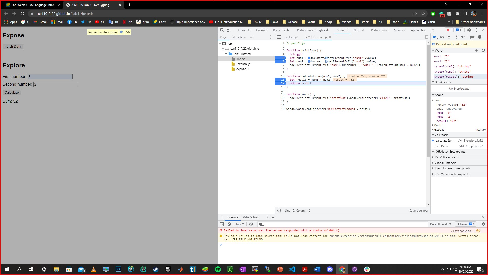

the scren shot showing the watchers for num1 and num2  
 
  
q1 
the bug was that the num1 and num2 is reading as string and adding them up as string insted of interger
 
q2 
the fix is to add parseInt in the function that add both number as shown 
 

the fix 
 
function printSum() { 
  debugger 
  let num1 = document.getElementById("num1").value; 
  let num2 = document.getElementById("num2").value; 
  document.getElementById("sum").innerHTML = "Sum: " + calculateSum(num1, num2); 
} 
 
function calculateSum(num1, num2) { 
  let x = parseInt(num1); 
  let y = parseInt(num2); 
  let result = x + y ; 
  console.log(result); 
  return result 
} 
 
function init() { 
  document.getElementById('printSum').addEventListener('click', printSum); 
} 

window.addEventListener('DOMContentLoaded', init); 