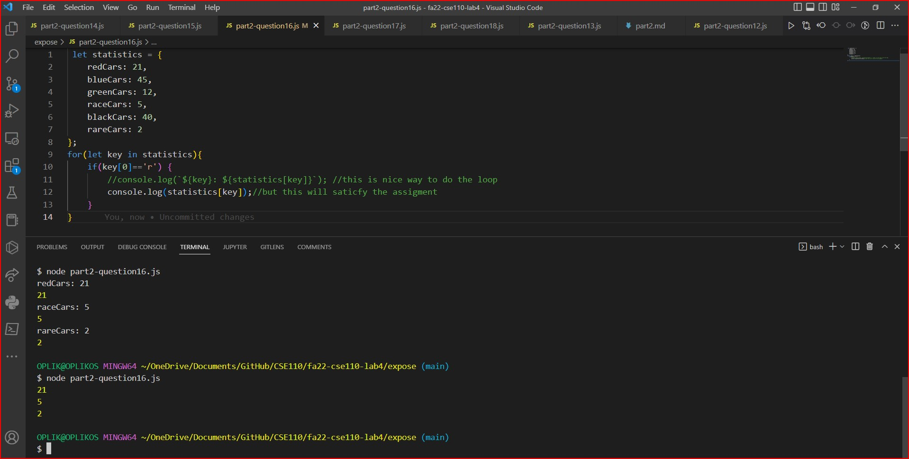
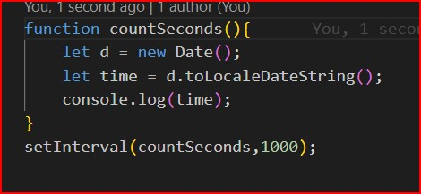

# Part 2

- [question 1](/expose/part2-question1.js): this will to print 3 because the var i is incremented 3 time in the loop and quit when i t was 3 > 3 (price.lenght which is 3 (3 times 0, 1, 2))
- [question 2](/expose/part2-question2.js): it will pring 150 because its the last value that contains the discountedPrice (the price was 300 then discount 50% = 150)
- [question 3](/expose/part2-question3.js): it will print 150 because its the last value that been hold in for loop which is using hte last value of discountePrice and rounding it up
- [question 4](/expose/part2-question4.js): it will return a Array of [50, 100, 150] becauase everytime we are calculating it we are pushing the discounted values to the array
- [question 5](/expose/part2-question5.js): it will give error i is not defined because it is getting defined in the for loop scop.
- [question 6](/expose/part2-question6.js): it will give error because it discountedPrice is not define in the scope its define in the the forloop scop.
- [question 7](/expose/part2-question7.js): it will print 150 because it is the last assigme value and the finalprice is defined in the head of the function.
- [question 8](/expose/part2-question8.js):it will return the a Array [50, 100, 150] becuase everytime is properly layed down and not interferance and in for loop when we are calculating the finalprice we are pushing it to discounted which is define in the head of the function.
- [question 9](/expose/part2-question9.js): just like before i is let and it cant go obove the scope of for loop so same as question 5 it will give error i is not defined because it is getting defined in the for loop scop.
- [question 10](/expose/part2-question10.js): this will to print 3 because the lenght is const and is not beeing changed from the begining it will run smothly 
- [question 11](/expose/part2-question11.js): this will return a Array [50, 100, 150] becuase everytime is properly layed down and not interferance and in for loop when we are calculating the discountedPrice as we are definein it as const and pushing it to discounted and when it goes back to second loop it will still work cause its beeing as ques cariable constant
- [question 12](/expose/part2-question12.js):  
        *Tabspace* A. console.log(student.name); 
        *Tabspace* B. console.log(student['Grad Year']); 
        *Tabspace* C. console.log(student.greeting()); 
        *Tabspace* D. console.log(student['Favorite Teacher'].name); 
        *Tabspace* E. console.log(student.courseload[0]); 
- [question 13](/expose/part2-question13.js):Arithmetic  
        *Tabspace* A. ‘3’ + 2 = 32. 
        *Tabspace* B. ‘3’ - 2 = 1. 
        *Tabspace* C. 3 + null = 3. 
        *Tabspace* D. ‘3’ + null = 3null. 
        *Tabspace* E. true + 3 = 4. 
        *Tabspace* F. false + null = 0. 
        *Tabspace* G. '3' + undefined = 3undefined. 
        *Tabspace* h. '3' - undefined = NaN. 
- [question14](part2-question14.js): Comparison   
        *Tabspace* A. '2' > 1 = true. 
        *Tabspace* B. '2' < '12' = false. 
        *Tabspace* C. 2 == '2' = true. 
        *Tabspace* D. 2 === '2' = false. 
        *Tabspace* E. true == 2 = false. 
        *Tabspace* F. true === Boolean(2) = true. 
- [question15](part2-question15.js):the both do compareson of the values but the === will also check the data type shown in the example(part2-question15.js) 
- [question16](part2-question16.js):   
- [question17](part2-question17.js):very simply we call modify with array and function as parameter. in the function modify we will call the the function in the parameter (doSomething) as renamed callback for each loop values it will multiply and push it to new array and return it 
- [question18](part2-question18.js):    
- [question19](part2-question19.js): very simple so when we call the function it will print 1 cuase there is no delay then it will continue to second line where it will put in its queue after 1 second to print the log 2, read line 3 where its saying to print 3 at time 0 but the 4the line print 4 is before the timer starts so it will add the 4 right after 1, so the function is called it prints 1 and prints 4 then as soon as the timer starts it prints 3 and then it prints 2  
